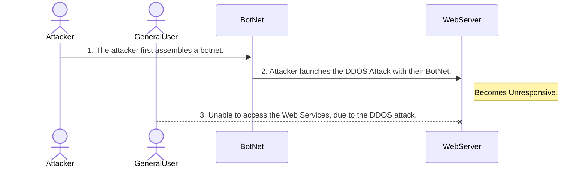
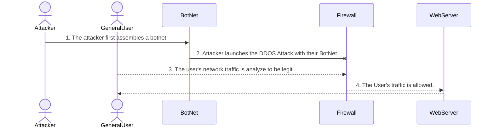

# DDoS_Attack_Sequence.md
By Brandon Norris

#### DDOS Attack Steps
#####	1. The attacker first assembles a botnet, which is a network of computers under their control. This can be done by using their own systems or by infecting other users’ devices with malware to gain remote access. 
#####	2. Once the botnet is in place, the attacker launches the Distributed Denial of Service (DDoS) attack. This involves flooding the target web server with a massive number of simultaneous connection requests. The goal is to overwhelm the server’s resources, preventing legitimate users from accessing it. Without proper defenses, the server can become unresponsive or crash entirely under the load.
#####	3.Detecting and stopping a DDoS attack can be challenging, especially since high traffic isn’t always suspicious—businesses often want more visitors. In many cases, the first step in mitigation may be to temporarily take the server offline to assess and respond to the threat.
######	However, several proactive security measures can help:
	* Firewall Configuration: Firewalls can be set to block known malicious IP ranges and filter out traffic on unused or suspicious ports.
	* Intelligent Firewalls: Advanced firewalls like Cisco’s Adaptive Security Appliance (ASA) can leverage AI and behavioral analysis to detect and stop DDoS attacks in real-time by analyzing incoming traffic patterns and identifying botnet behavior.

