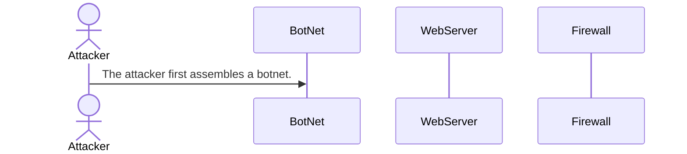

# DDoS_Attack_Sequence.md
DDoS_Attack_Sequence.md

#### DDOS Attack Steps
	1. The attacker first assembles a botnet, which is a network of computers under their control. This can be done by using their own systems or by infecting other users’ devices with malware to gain remote access

